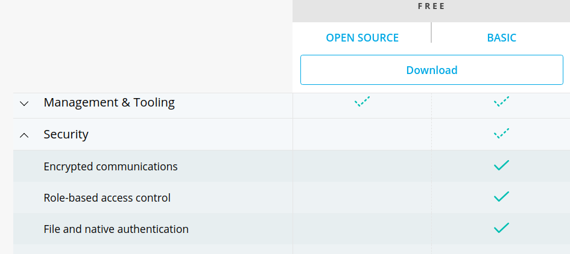
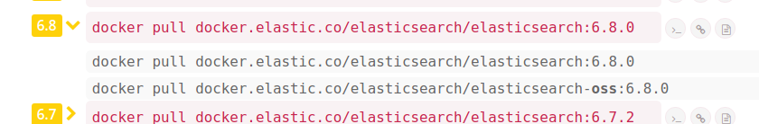
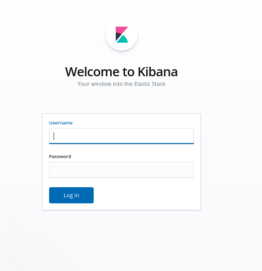

# Setting up Elasticsearch and Kibana on Docker with X-Pack security enabled
From: http://codingfundas.com/setting-up-elasticsearch-6-8-with-kibana-and-x-pack-security-enabled/index.html

This tutorial assumes that you are familiar with Elasticsearch and Kibana and have some understanding of Docker. Before diving into the objective of this article, I would like to provide a brief introduction about X-Pack and go over some of the latest changes in Elasticsearch version 6.8 which allow us to use the security features of X-Pack for free with the basic license.

## X-Pack Security and Elasticsearch 6.8

X-Pack is a set of features that extend the Elastic Stack, that is Elasticsearch, Kibana, Logstash and Beats. This includes features like security, monitoring, machine learning, reporting, etc. In this article, we are mainly concerned with the security features of X-Pack.

X-Pack security makes securing you Elasticsearch cluster very easy and highly customizable. It allows you to setup authentication for your Elasticsearch cluster, create different users with different credentials and different levels of access. It also allows you to create different roles and assign similar users to same role. For example, if you want to grant read-only access to certain users to certain indices of your cluster but want to ensure they cannot write to those indices, you can easily achieve that with X-pack security. And this is just the tip of the iceberg. You can check-out the security API here for a more detailed view of what all you can do with it.


But all these features were not always available for free. Prior to version 6.8, security was not a part of the Basic license. I'll quickly explain what this means. The Elastic Stack has 4 different types of licenses that you can see here

- Open Source
- Basic
- Gold
- Platinum


Gold and Platinum are paid licenses whereas Open Source and Basic are free. If you visit the above mentioned link, you can see what all features are available under which license. If you see the security dropdown on that page, you can see that some of the security features are available as a part of Basic license. As of writing this article, following security features are availale under Basic license:



Now this list reflects the latest version of Elastic Stack which at the time of writing this article, is version 7.1. Security was made available under basic license from version 6.8 onwards. This is important because it means that if you want to be able to use security features in your Elasticsearch setup for free, you need to have version 6.8 onwards for this.


And that's what we will be using for this article.

## Objective

The objective of this article is to setup Elasticsearch and Kibana using Docker Compose with security features enabled. We will be setting up basic authentication on Elasticsearch so that all the API calls will need to include the Bearer token. Also, Kibana UI will require the username and password to login. For our setup, we will be using Docker Compose which makes our entire setup very easy to depoy anywhere and scale. I'll be using Ubuntu 18.04 for this tutorial but the steps will remain more or less same on any other unix based systems and might not be too different on a Windows based system as well. The only piece of code that we will be writing in this article is a docker-compose.yml file. We will be starting with a minimal docker-compose.yml file to get the elasticsearch and kibana setup up and running and then gradually we will tweak it to enable the security features.

## Pre requisites
- Linux based OS
- Docker and Docker Compose installed
- Basic understanding of Docker and Docker Compose
- Knowledge of Elasticsearch and Kibana
- Experience with Linux command line

If you are using some other operating system, you can follow the instructions specific to that OS but the process remains more or less the same.


### Step 1 - Create a basic docker-compose.yml file for Elasticsearch and Kibana

In this step we will create our docker-compose.yml file with two services, elasticsearch and kibana and map their respective ports to the host OS


Let us first start with creating a directory for our project. Open your terminal and type the following

```
$ cd
$ mkdir elasticsearch-kibana-setup
$ cd elasticsearch-kibana-setup
$ touch docker-compose.yml
```


Then open the newly created docker-compose.yml file and paste the following lines in it:

```
version: '3'
services:
  elasticsearch:
    image: docker.elastic.co/elasticsearch/elasticsearch:6.8.0
    ports:
      - 9200:9200

  kibana:
    depends_on:
      - elasticsearch  
    image: docker.elastic.co/kibana/kibana:6.8.0
    ports:
      - 5601:5601
```

The official docker images for Elastic Stack can be found [here](https://www.docker.elastic.co/#)

As discussed in the beginning of this article, we will be using version 6.8 for this setup. If you visit the above link and click on Elasticsearch image 6.8 to expand, you'll see two images:

```
docker pull docker.elastic.co/elasticsearch/elasticsearch:6.8.0   
docker pull docker.elastic.co/elasticsearch/elasticsearch-oss:6.8.0
```



You can see that one of them has `oss` tag while the other does not. The difference between these two images is the license. The oss one comes with open source license whereas the non-oss one comes with the basic license. Since the x-pack security features are only available with the basic license, we will be using the non-oss version. Please note that this is also free as explained in the beginning of the article.

Apart from specifying the images, we are mapping the ports of the containers to the ports on the host machine. Elasticsearch runs on port 9200 and Kibana on port 5601 so we are mapping both these ports to the corresponding ports on the host machine. You can map them to some other port as well. The syntax remains the same:

```
<Host Port>:<Container Port>
```

So, for instance, if you want to access elasticsearch on port 8080 of your host machine, you'll need to specify the config as:

```
8080:9200
```


For now we'll be mapping it to `9200` in this article. Also the `depends_on` setting in kibana service ensures that it is not started until elasticsearch service is up and running. So, let's try to start our setup with the above settings by running the following command:
```
$ docker-compose up
```

This will start pulling the images from docker registry and create the containers. This may take a while depending on whether you already have the images on your machine or not and also depending on your internet speed. After the images have been pulled, you'll start seeing container logs which will take a few more seconds. Once both Elasticsearch and Kibana are ready, you'll see something like this in your console:

```
elasticsearch_1  | [2019-06-09T10:14:21,167][INFO ][o.e.c.r.a.AllocationService] [pKPbPLz] Cluster health status changed from [YELLOW] to [GREEN] (reason: [shards started [[.kibana_1][0]] ...]).
kibana_1         | {"type":"log","@timestamp":"2019-06-09T10:14:21Z","tags":["info","migrations"],"pid":1,"message":"Pointing alias .kibana to .kibana_1."}
kibana_1         | {"type":"log","@timestamp":"2019-06-09T10:14:21Z","tags":["info","migrations"],"pid":1,"message":"Finished in 175ms."}
kibana_1         | {"type":"log","@timestamp":"2019-06-09T10:14:21Z","tags":["listening","info"],"pid":1,"message":"Server running at http://0:5601"}
elasticsearch_1  | [2019-06-09T10:14:21,282][INFO ][o.e.c.m.MetaDataIndexTemplateService] [pKPbPLz] adding template [kibana_index_template:.kibana] for index patterns [.kibana]
elasticsearch_1  | [2019-06-09T10:14:21,326][INFO ][o.e.c.m.MetaDataIndexTemplateService] [pKPbPLz] adding template [kibana_index_template:.kibana] for index patterns [.kibana]
elasticsearch_1  | [2019-06-09T10:14:21,343][INFO ][o.e.c.m.MetaDataIndexTemplateService] [pKPbPLz] adding template [kibana_index_template:.kibana] for index patterns [.kibana]
kibana_1         | {"type":"log","@timestamp":"2019-06-09T10:14:22Z","tags":["status","plugin:spaces@6.8.0","info"],"pid":1,"state":"green","message":"Status changed from yellow to green - Ready","prevState":"yellow","prevMsg":"Waiting for Elasticsearch"}
```


Look for the lines where it says status has changed to `green`. This means that our setup is ready. If you don't see such lines and see any error message it means something went wrong. You'll need to debug the issue and resolve it.

Once the services are up and running, open your browser and open the url http://localhost:9200/ and you will see something like this:

```
{
  "name" : "pKPbPLz",
  "cluster_name" : "docker-cluster",
  "cluster_uuid" : "AjqbFZ0qRF-X0_TQZqWIZA",
  "version" : {
    "number" : "6.8.0",
    "build_flavor" : "default",
    "build_type" : "docker",
    "build_hash" : "65b6179",
    "build_date" : "2019-05-15T20:06:13.172855Z",
    "build_snapshot" : false,
    "lucene_version" : "7.7.0",
    "minimum_wire_compatibility_version" : "5.6.0",
    "minimum_index_compatibility_version" : "5.0.0"
  },
  "tagline" : "You Know, for Search"
}
```

That's elasticsearch. Also, if you navigate to [http://localhost:5601/](http://localhost:5601/) you should see the Kibana console. So, with just 13 lines of code in your docker-compose.yml file, you have setup a single node cluster of Elasticsearch and Kibana.

Now although this works, there is a security challenge if you want to deploy it to production. If your server is not a part of a VPC (Virtual Private Cloud) and the ports 9200 and 5601 are accessible to the world, your Elasticsearch and Kibana services can be accessed by anyone. There is no authorization so anyone make any changes to your cluster using the Elasticsearch API directly or through Kibana UI. What if we wanted to keep those ports accessible but require some sort of authentication so that only those who have the right credentials can access our Elasticsearch instance or login to the Kibana UI? Also, what if we want to ensure that certain users should only have limited set of priveleges? For example, we want certain users to be able to search any index in our Elasticsearch cluster but not be able to create any new index or drop any index or change any mapping or write to an index. Or let's say you don't want your Elasticsearch instance directly accessible to the rest of the world but want to keep the Kibana UI accessible and behind authentication and you want different users of Kibana UI to have different access levels. All of this can be achieved with X-Pack security and that's what we will be exploring next.

Go back to the terminal window where you ran the `docker-compose up` command and press `CTRL+C` to stop the containers and tear down the setup.

## Step 2 - Customize Elasticsearch and Kibana services with environment variables

In order to enable X-Pack security, we will need to customize our elasticsearch and kibana services. Elasticsearch settings can be customized via elasticsearch.yml file and Kibana settings can be customized via kibana.yml file. There are many ways to change this while using docker. We can pass enviroment variables via our docker-compose.yml file. Although this would normally be an ideal way, but the way Elasticsearch and Kibana env variables are passed is not the same and can cause problems in certain deployment environments. You can read more about it here. For this tutorial, we will be creating custom elasticsearch.yml and kibana.yml files and bind mount these to their respective containers, overriding the default files in those container.

This will become more clear in next steps. First, create two files `elasticsearch.yml` and `kibana.yml` in the same directory as our docker-compose.yml file:


```
$ touch elasticsearch.yml
$ touch kibana.yml
```

Then open elasticsearch.yml and paste the following lines in it:

```
cluster.name: my-elasticsearch-cluster
network.host: 0.0.0.0
xpack.security.enabled: true
```

Here we are setting the name of our cluster to my-elasticsearch-cluster. The setting network.host: 0.0.0.0 means that elasticsearch will be accessible from all IP addresses on the host machine if the host machine has more than one network interface. And the last setting is to enable X-Pack security. This ensures that anyone trying to access our Elasticsearch instance must provide the authentication token.


Now open the kibana.yml file and paste the following lines in it:

```
server.name: kibana
server.host: "0"
elasticsearch.hosts: [ "http://elasticsearch:9200" ]
```


Here we are setting the server name. The server.host: "0" means that the Kibana instance should be accessible from all the IP addresses on the host machine if the host machine has more than one network interface. And the last setting elasticsearch.hosts includes the list of addresses of the Elasticsearch nodes. Kibana instance can reach out to the Elasticsearch instance by using the address http://elasticsearch:9200. This is achieved by Docker Compose. If you have multiple services in your compose file, containers belonging to one service can reach out to container of other services by using the other service's name. You don't even need to expose the ports for this. So, in our docker-compose.yml file, even if we had not mapped the ports for Elasticsearch, our Kibana instance would still be able to reach out to Elasticsearch instance at http://elasticsearch:9200. However, in that case, we won't be able to connect to our Elasticsearch instance from our host machine. I won't be diving further deep into the details of how networking works in Docker because that will be beyond the scope of this article. But I would definitely suggest you to go through the official docs to get a better understanding.


Ok, so now that we have our config files ready, we need to bind mount them to their respective containers in our docker-compose.yml file. So open the docker-compose.yml file and change it to look like this:

```
version: '3'
services:
  elasticsearch:
    image: docker.elastic.co/elasticsearch/elasticsearch:6.8.0
    ports:
      - 9200:9200
    volumes:
      - ./elasticsearch.yml:/usr/share/elasticsearch/config/elasticsearch.yml

  kibana:
    depends_on:
      - elasticsearch  
    image: docker.elastic.co/kibana/kibana:6.8.0
    ports:
      - 5601:5601
    volumes:
      - ./kibana.yml:/usr/share/kibana/config/kibana.yml
```

The only changes we have made here is that we have added the volumes section. By using volumes we can map a directory or an individual file from host machine to a directory or a file on the container. Here we are mapping individual files only. The default location of config file in Elasticsearch container is /usr/share/elasticsearch/config/elasticsearch.yml and we are replacing it with the elasticsearch.yml file that we created earlier. Similarly, we are replacing the default kibana.yml file at `/usr/share/kibana/config/kibana.yml` with our newly created file. With these changes, let's try to start our docker compose setup again by running the command:

```
$ docker-compose up
```

This will most likely give you an error. If you see the elasticsearch logs (lines starting with elasticsearch_1 |), you might see some error like this:

```
elasticsearch_1  | [1]: Transport SSL must be enabled if security is enabled on a [basic] license. Please set [xpack.security.transport.ssl.enabled] to [true] or disable security by setting [xpack.security.enabled] to [false]
```

This means that Elasticsearch won't start since the initial checks have failed. Consequently, Kibana won't be able to connect to it and you'll see something like this in Kibana logs:

```
kibana_1         | {"type":"log","@timestamp":"2019-06-11T17:31:14Z","tags":["warning","elasticsearch","admin"],"pid":1,"message":"No living connections"}
```


Press Ctrl+C to stop the containers and tear down the setup because this ain't working and we gotta fix it.

In order to get elasticsearch working, we will need to enable SSL and also install the SSL certificate in our elasticsearch container. I will be walking through the process of creating a new certificate and using that. If you already have a certificate file, you can skip that part. For this, we will need to take a step back and disable x-pack security on our elasticsearch instance so that we can get it up and running and then we will get inside our container shell and generate the certificate.

## Step 3 - Create SSL certificate for Elasticsearch and enable SSL


First, we need to disable x-pack security temporarily so that we can get our Elasticsearch container up and running. So, open the `elasticsearch.yml` file and disable x-pack security by changing the following line:

```
xpack.security.enabled: false
```

Then bring up the containers again by running:

```
$ docker-compose up
```

This should work fine now and bring up our Elasticearch and Kibana services just like before. Now, we need to generate the certificates and we will be using elasticsearch-certutil utility. For this, we will need to get inside our docker container running elasticsearch service. This is really easy using docker-compose. Think of it like this, we can execute any command inside a docker container by using the command:

```
$ docker-compose exec <service name> <command>
```

And if we want to get inside the container's shell, we essentially want to execute the bash command on our container. So, our command becomes:

```
$ docker-compose exec elasticsearch bash
```

Here `elasticsearch` is our service and bash is our command. We need to do this while the container is running so open another terminal window and paste the above command (make sure to run this command from the same directory where your docker-compose.yml file is located)

Once you're inside the container, your shell prompt should look something like this:

```
[root@c9f915e86309 elasticsearch]#
```

Now run the following command here:

```
[root@c9f915e86309 elasticsearch]# bin/elasticsearch-certutil ca
```

This will generate some warnings describe what it is going to do. I recommend you read that. And it will prompt you for file name and password. Just press ENTER for both to proceed:

```
Please enter the desired output file [elastic-stack-ca.p12]: 
Enter password for elastic-stack-ca.p12 : 
```

This will create a file elastic-stack-ca.p12 in the directory from which you ran the above command. You can check by running the ls command. This is the certificate authority we will be using to create the certificate. Now, run the command:

```
[root@c9f915e86309 elasticsearch]# bin/elasticsearch-certutil cert --ca elastic-stack-ca.p12
```

This will again raise some warnings and describe what it is going to do. I recommend you read that too. And it will prompt you for password and file name. Press ENTER at all the steps to proceed:

```
Enter password for CA (elastic-stack-ca.p12) : 
Please enter the desired output file [elastic-certificates.p12]: 
Enter password for elastic-certificates.p12 : 
```

This will create the `elastic-certificates.p12` which is what we need. We need this file outside the container on the host machine because it will be vanish once we destroy our container. This file is in PKCS12 format which includes both the certificate as well as the private key. In order to copy this file outside the container to host machine, press CTRL+D to first exit the container


And then run the following command on your host machine (from the same directory where docker-compose.yml file is present)

```
$ docker cp "$(docker-compose ps -q elasticsearch)":/usr/share/elasticsearch/elastic-certificates.p12 .
```

The above command might seem a bit tricky to some so I will add a bit of explanation here. For those of you who understand how it works can proceed to Step 4.

Let us first see what `docker-compose ps` does. If you run the command you'll see output like this:

```
                      Name                                    Command               State                Ports              
----------------------------------------------------------------------------------------------------------------------------
elasticsearch-kibana-setup_elasticsearch_1   /usr/local/bin/docker-entr ...   Up      0.0.0.0:9200->9200/tcp, 9300/tcp
elasticsearch-kibana-setup_kibana_1          /usr/local/bin/kibana-docker     Up      0.0.0.0:5601->5601/tcp          
```


This shows all the docker containers running or stopped which are being managed by our docker-compose.yml file.


If you check the help for this command:

```
$ docker-compose ps --help
```

You will see output like this:

```
List containers.

Usage: ps [options] [SERVICE...]

Options:
    -q, --quiet          Only display IDs
    --services           Display services
    --filter KEY=VAL     Filter services by a property
```

You can see that by using -q flag, we can get just the id of the container. And also you can see that by providing the service name, we can limit the output to just the service we are interested in. So, if we want to get the id of the elasticsearch container, we need to run the command:

```
$ docker-compose ps -q elasticsearch
```

This should get you the id of the elasticsearch container.

Now, if we go back to our docker cp command above, you can check the syntax of that command by using help again:

```
$ docker cp --help
```


This should display the help:

```

Usage:	docker cp [OPTIONS] CONTAINER:SRC_PATH DEST_PATH|-
	docker cp [OPTIONS] SRC_PATH|- CONTAINER:DEST_PATH

Copy files/folders between a container and the local filesystem

Options:
  -a, --archive       Archive mode (copy all uid/gid information)
  -L, --follow-link   Always follow symbol link in SRC_PATH

```

You can see that we need to specify the command as:

```
docker cp <container id>:<src path> <dest path on host>
```

Our source path in this case is `/usr/share/elasticsearch/elastic-certificates.p12` on the elasticsearch container. And we are getting the id of the elasticsearch container by using the docker-compose ps -q elasticsearch command. And we need to copy the file to the current directory on host so our destination path is .. Hence the command becomes:

```
$ docker cp "$(docker-compose ps -q elasticsearch)":/usr/share/elasticsearch/elastic-certificates.p12 .
```

We will also copy the CA file by running the command:

```
$ docker cp "$(docker-compose ps -q elasticsearch)":/usr/share/elasticsearch/elastic-stack-ca.p12 .
```

Now that we have our certificate file on our host machine, we will be bind mounting it to our container just like the way we did for elasticsearch.yml file. So, if you already have an SSL certificate you can use that too in place of this one.

## Step 4 - Installing the SSL certificate on Elasticsearch and enabling TLS in config

Now that we have the SSL certificate available, we can enable the x-pack security on our elasticsearch node and also enable TLS. First, we need to bind mount our certificate from host machine to container. First, go back to the terminal where you ran docker-compose up command and press CTRL+C to stop the containers. Then open the docker-compose.yml file and change it so that it look like this:

```
version: '3'
services:
  elasticsearch:
    image: docker.elastic.co/elasticsearch/elasticsearch:6.8.0
    ports:
      - 9200:9200
    volumes:
      - ./elasticsearch.yml:/usr/share/elasticsearch/config/elasticsearch.yml
      - ./elastic-certificates.p12:/usr/share/elasticsearch/config/elastic-certificates.p12

  kibana:
    depends_on:
      - elasticsearch
    image: docker.elastic.co/kibana/kibana:6.8.0
    ports:
      - 5601:5601
    volumes:
      - ./kibana.yml:/usr/share/kibana/config/kibana.yml
```


Now, open your `elasticsearch.yml` file and change it to this:
```
cluster.name: my-elasticsearch-cluster
network.host: 0.0.0.0
xpack.security.enabled: true
xpack.security.transport.ssl.enabled: true
xpack.security.transport.ssl.keystore.type: PKCS12
xpack.security.transport.ssl.verification_mode: certificate
xpack.security.transport.ssl.keystore.path: elastic-certificates.p12
xpack.security.transport.ssl.truststore.path: elastic-certificates.p12
xpack.security.transport.ssl.truststore.type: PKCS12
```

First 3 lines are same as before (we have changed xpack.security.enabled to true again). Rest of the lines denote the SSL settings and location of our certificate and private key, which is the same. You can check out all the [security settings](https://www.elastic.co/guide/en/elasticsearch/reference/current/security-settings.html) here.

Once this is done, go back to terminal and bring up the container again

```
$ docker-compose up
```

So, what do you see? Still not working eh? This is because now Kibana is not able to connect to our Elasticsearch instance because now we have security enabled but haven't configured the credentials on Kibana. So, you'll see continous logs like this:

```
kibana_1         | {"type":"log","@timestamp":"2019-06-11T19:03:35Z","tags":["warning","task_manager"],"pid":1,"message":"PollError [security_exception] missing authentication token for REST request [/_template/.kibana_task_manager?include_type_name=true&filter_path=*.version], with { header={ WWW-Authenticate=\"Basic realm=\\\"security\\\" charset=\\\"UTF-8\\\"\" } }"}
```

Also, if you open your web browser and go to [http://localhost:9200](http://localhost:9200) you will see a prompt for username and password. And if you press ESC, you get this error:

```
{
  "error": {
    "root_cause": [
      {
        "type": "security_exception",
        "reason": "missing authentication token for REST request [/]",
        "header": {
          "WWW-Authenticate": "Basic realm=\"security\" charset=\"UTF-8\""
        }
      }
    ],
    "type": "security_exception",
    "reason": "missing authentication token for REST request [/]",
    "header": {
      "WWW-Authenticate": "Basic realm=\"security\" charset=\"UTF-8\""
    }
  },
  "status": 401
}
```

And if you try visiting http://localhost:5601 you will get the error:

```
Kibana server is not ready yet
```

So, we have solved one part of the problem. We have secured our Elasticsearch instance and nobody can access it without providing the correct credentials. But we don't know what the correct credentials are. We will be setting those up in the next step and configuring Kibana to use those. For now, keep the docker-compose up command running since we need to go inside the Elasticsearch container again

## Step 5 - Generate default passwords and configure the credentials in Kibana

Before we generate the passwords for built-in accounts of Elastic stack, we will first need to change our docker-compose.yml file to bind mount the data volume of Elasticsearch. Up until now, the storage of our containers has been temporary. It means that once we destroy the containers, all the data inside of them gets destroyed as well. So if you created any indices, users, etc in Elasticsearch, they will no longer persist once you do docker-compose down to bring down the services. That's not something we would want in production. We want to ensure that the data changes persist between container restarts. For that, we will need to bind mount the data directory from elasticsearch container to a directory on the host machine.


First, bring down all the running containers by executing the following command:

```
docker-compose down
```

Then create a directory called docker-data-volumes in the same directory where your docker-compose.yml file is located. You can give it any other name but for this tutorial we will call it docker-data-volumes. Inside that directory, create another directory called elasticsearch

```
mkdir docker-data-volumes
mkdir docker-data-volumes/elasticsearch
```

Now under the volumes section of elasticsearch service in your docker-compose.yml file, add the following line:

```
      - ./docker-data-volumes/elasticsearch:/usr/share/elasticsearch/data
```

As explained earlier, when we need to bind mount a file or directory from host machine to container, we specify the <host path>:<container path>. The default path for data inside an elasticsearch container is `/usr/share/elasticsearch/data` and we are binding it to the directory `./docker-data-volumes/elasticsearch` on host machine. So your docker-compose.yml file should now look like this:
```
version: '3'
services:
  elasticsearch:
    image: docker.elastic.co/elasticsearch/elasticsearch:6.8.0
    ports:
      - 9200:9200
    volumes:
      - ./elasticsearch.yml:/usr/share/elasticsearch/config/elasticsearch.yml
      - ./elastic-certificates.p12:/usr/share/elasticsearch/config/elastic-certificates.p12
      - ./docker-data-volumes/elasticsearch:/usr/share/elasticsearch/data

  kibana:
    depends_on:
      - elasticsearch
    image: docker.elastic.co/kibana/kibana:6.8.0
    ports:
      - 5601:5601
    volumes:
      - ./kibana.yml:/usr/share/kibana/config/kibana.yml 
```

Bring up the containers by running

```
docker-compose up
```

While docker-compose up is running in one terminal, open another terminal to get inside the elasticsearch container by running the command:

```
$ docker-compose exec elasticsearch bash
```

Then run the following command to generate passwords for all the built-in users:

```
[root@c9f915e86309 elasticsearch]# bin/elasticsearch-setup-passwords auto
```

Note them down and keep them somewhere safe. Exit the container by pressing CTRL+D

Now open the kibana.yml file and change it to this:
```
server.name: kibana
server.host: "0"
elasticsearch.hosts: [ "http://elasticsearch:9200" ]
elasticsearch.username: kibana
elasticsearch.password: <kibana password>
```


You need to put the password for kibana user here in the elasticsearch.password setting.

Go to the terminal where docker-compose up was running and press CTRL+C to bring the containers down. And then run the command again

```
$ docker-compose up
```

This should bring up both the services, elasticsearch and kibana. Now, if you open your browser and visit [http://localhost:9200](http://localhost:9200) it will again prompt you for username and password. Here, enter the username as elastic and enter the password for the user elastic that you got earlier. You should be able to see the output like this on successful authentication:

```
{
  "name" : "1mG1JlU",
  "cluster_name" : "my-elasticsearch-cluster",
  "cluster_uuid" : "-mEbLeYVRb-XqA24yq6D1w",
  "version" : {
    "number" : "6.8.0",
    "build_flavor" : "default",
    "build_type" : "docker",
    "build_hash" : "65b6179",
    "build_date" : "2019-05-15T20:06:13.172855Z",
    "build_snapshot" : false,
    "lucene_version" : "7.7.0",
    "minimum_wire_compatibility_version" : "5.6.0",
    "minimum_index_compatibility_version" : "5.0.0"
  },
  "tagline" : "You Know, for Search"
}
```

Also, if you open [http://localhost:5601](http://localhost:5601) you will see the Kibana console but now it will ask for username and password:



Here also enter the username as elastic and password for the same. You will see the Kibana console on successful authentication.


If you followed all the steps correctly till now, you should be able to login to Kibana console now.

Now if you click on the *Management* tab in the sidebar, you will see *Security* section on the right hand side panel.

```
You can see the users, roles, create new role or create new user over here. There is a lot you can do here and I would recommend you play with it for a while to get a feel of it.
```

## Conclusion
This completes our tutorial and our setup of an Elasticsearch and Kibana cluster with basic license (Free) using docker-compose, with X-Pack security enabled. I hope you found it helpful and if you have any suggestions or find any errors, feel free to comment below.

Happy Coding :-)

## Reference
- [Tutorial authen SSL](http://codingfundas.com/setting-up-elasticsearch-6-8-with-kibana-and-x-pack-security-enabled/index.html)
- [Authenticate kibana with nginx](https://documentation.wazuh.com/3.7/installation-guide/optional-configurations/kibana_ssl.html)


